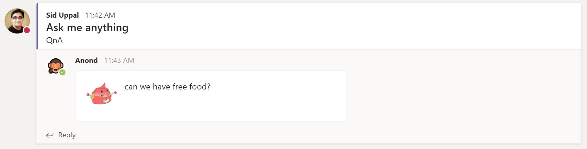

# Anond - the anonymous reply message-action bot for Teams


This sample demonstrates how to utilize message-actions feature in Microsoft Teams to implement a bot that helps users anonymously reply to messages.



# Concepts demonstrated
* How to construct the app manifest to allow your bot to participate in message-actions.
* How to send Task Module dialogs from your bot code.
* How to handle submission of Task Module dialog.
* How to post a reply to a message in a channel from a Task Module submission.

# How to run the sample on your local machine
* Go to [this link](https://docs.microsoft.com/en-us/microsoftteams/platform/concepts/bots/bots-create) to register a new Bot Framework bot. Don't forget to add the Teams channel.
* You will get an Application ID and Application Secret during registration. Paste these values into web.config.
* Paste the Application ID into the manifest.json file.
* [Download ngrok](https://ngrok.com/download) and launch it like so: ```ngrok http 3979 --host-header=localhost```.
* Update your bot's definition in Bot Framework to point to the ngrok URL https tunnel URL.
* Zip up the folder containing manifest.json and sideload this app into Teams by going into a team where you want to test it, and then selecting ... -> Manage Team --> Apps and then "Upload a custom app".
* Now when you or anyone in that team goes to a message in that team and selects ... they should see an option called Take Action --> Reply anonymously.
* If you set breakpoints in your bot code in MessagesController.cs, you should see those breakpoints being hit.
* Step-in in debugger and enjoy!

# How are users anonymized?
The code currently uses [HMACSHA1](https://docs.microsoft.com/en-us/dotnet/api/system.security.cryptography.rfc2898derivebytes?view=netframework-4.7.2) to hash the AAD ID of the user to a hash with the bot's Application Secret as the salt. The hash is converted into a base64string and then [RoboHash](https://robohash.org/) is used to convert this hash into a unique avatar for the user. The end result is that AAD ID of user is uniquely hashed to a Robohash avatar that stays the same for that user for each reply. 

Since message is posted by the bot on user's behalf, the user is "anonymous" for others in the team. Since the RoboHash avatar image that the user's ID gets mapped to remains the same everytime that user replies, the user replying remains anonymous while others still have a chance to associate the messages with that user's anonymous version which is important for continuity of conversation. 

So is the user truly "anonymous"? Not really. Clues for unmasking someone are in the description above. There might be other clues as well, e.g. language/grammer/tone, and excessive use of emojies or GIFs :)

# Contributing

This project welcomes contributions and suggestions.  Most contributions require you to agree to a
Contributor License Agreement (CLA) declaring that you have the right to, and actually do, grant us
the rights to use your contribution. For details, visit https://cla.microsoft.com.

When you submit a pull request, a CLA-bot will automatically determine whether you need to provide
a CLA and decorate the PR appropriately (e.g., label, comment). Simply follow the instructions
provided by the bot. You will only need to do this once across all repos using our CLA.

This project has adopted the [Microsoft Open Source Code of Conduct](https://opensource.microsoft.com/codeofconduct/).
For more information see the [Code of Conduct FAQ](https://opensource.microsoft.com/codeofconduct/faq/) or
contact [opencode@microsoft.com](mailto:opencode@microsoft.com) with any additional questions or comments.
